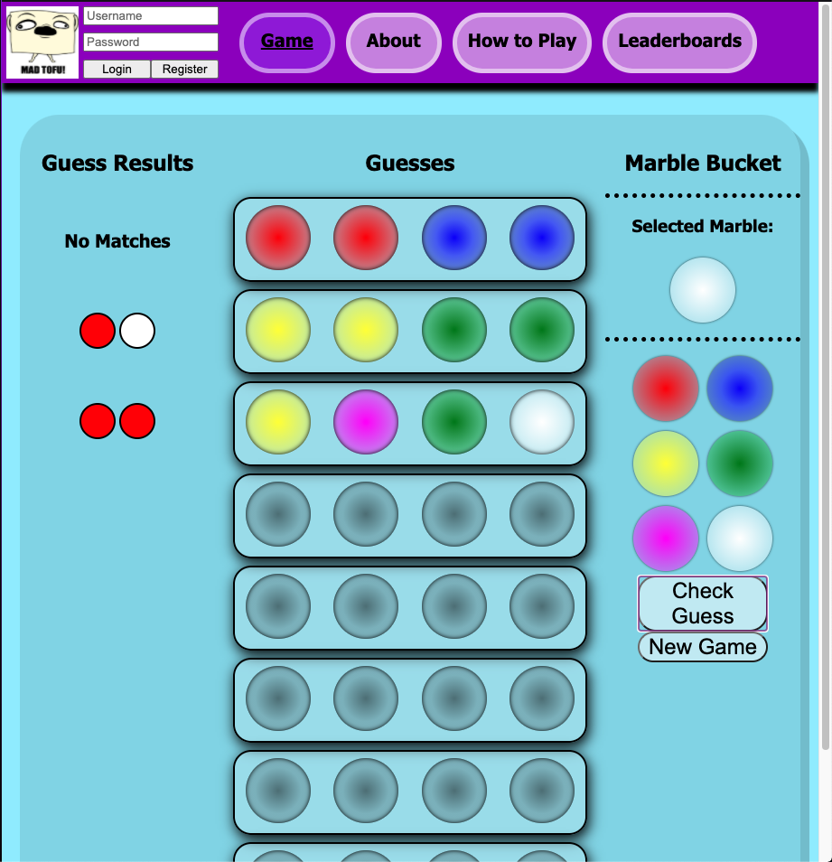

# MadTofu22's Marvelous Mastermind

## Description

This project is the culmination of knowledge I learned in Tiers 1 and 2 at [Prime Digital Academy](www.primeacademy.io). In this application User's are able to play the game Mastermind, create a profile, update their information, delete their profile, and view rankings on the leaderboards.

## Screenshot

## Prerequisites
This project uses the following software:

- [Node.js](https://nodejs.org/en/)
- [Postgresql](https://www.postgresql.org)
- [Nodemon](https://nodemon.io)

## Installation
Please follow these instructions if you would like to install this project for adaption or usage.

1. Download or clone down the source code.
2. Open the folder in your favorite editor.
3. Create a PostgreSQL Database called 'madtofus_marvelous_mastermind'.
4. Execute the commands in the database.sql file.
5. In a terminal navigate to the project folder.
6. Run `npm install` in the terminal.
7. Run `npm start` in the terminal.
8. Proceed to the Usage section!

## Usage
Please follow this flow to use this application.

1. Once loaded you are brought to the the Game page. Feel free to start playing if you know the rules!
2. Otherwise go to the How to Play page to see the instructions.
3. Register for an account by selecting Register in the top left corner.

## Built With
This project was built using React, CSS, and JavaScript.
The JavaScript libraries and frameworks used are:
- [Express.js](https://expressjs.com)
- [Body-Parser.js](https://www.npmjs.com/package/body-parser)
- [Postgresql](https://www.postgresql.org)
- [React](https://reactjs.org)
- [React Router](https://reactrouter.com)
- [Redux](https://redux.js.org)
- [Passport](http://www.passportjs.org)

## Acknowledgement
Thanks to [Prime Digital Academy](www.primeacademy.io) who equipped and helped me to make this application a reality.

A big thanks to the DashOnes for helping to test the game!

## Support
If you have questions, suggestions, or need to contact the development team for any reason, please email me at [stutler.tom@gmail.com](www.google.com).